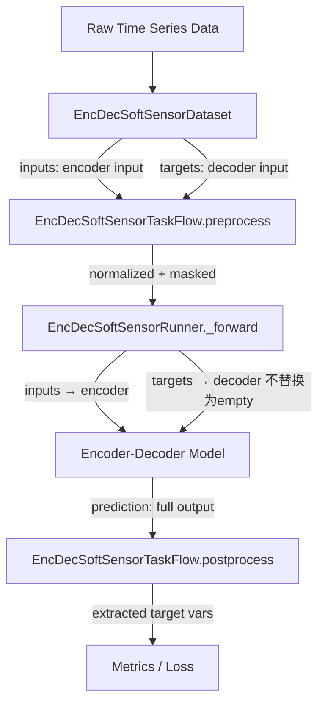
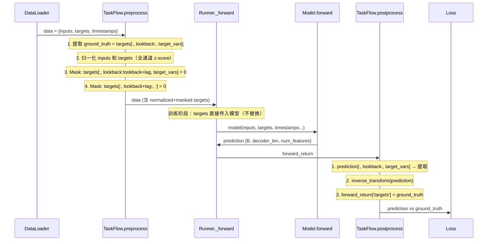
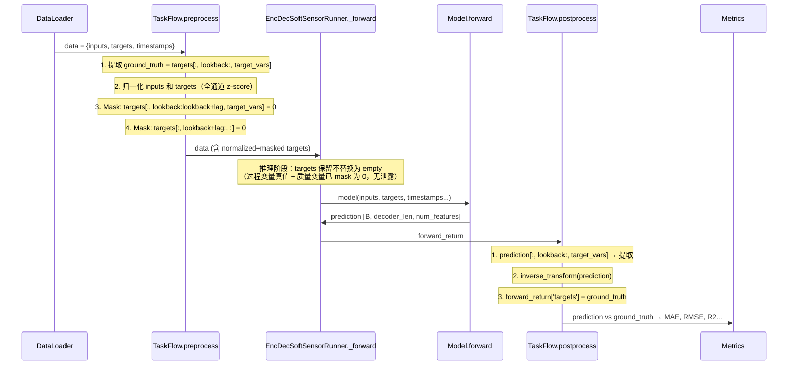
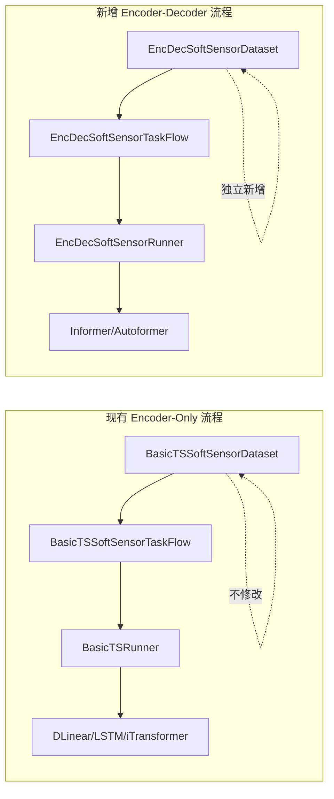

# Design: Encoder-Decoder 架构模型适配软测量任务

## Overview

本设计为 BasicTS 框架新增 encoder-decoder 架构模型（Informer、Autoformer 等）的软测量适配能力。核心思路是通过**时间维度划分**（而非现有的变量维度划分）来构造 encoder/decoder 输入对，配合 mask 策略防止信息泄露，使得 encoder-decoder 模型无需任何结构修改即可执行软测量任务。

**设计原则：**
- 模型零修改：所有适配逻辑封装在 Dataset + TaskFlow 层
- 与现有 encoder-only 软测量流程完全解耦，互不影响
- 通用性：适用于所有具有 `forward(inputs, targets, ...)` 签名的 encoder-decoder 模型

**关键洞察：**
现有 Informer 等模型的 `forward` 方法接收 `inputs`（encoder 输入）和 `targets`（decoder 输入）。BasicTS runner 的 `_forward` 方法通过 inspect 模型签名自动将 data dict 中的对应 key 传入模型。因此，只要 Dataset 返回正确 shape 的 `inputs` 和 `targets`，模型即可直接工作。

## Architecture

### 系统架构



### 数据流详解

```
时间轴:  [t_begin ............... t0 ............... t_end ... t_end+pred_len)
          |<-- encoder input -->|  |<-- lag zone -->|  |<-- pred zone -->|
                                |<-lookback->|

Dataset 输出:
  inputs  = raw_data[t_begin : t0]                    shape: [input_len - measurement_lag, num_features]
  targets = raw_data[t0-lookback : t_end+pred_len]    shape: [lookback + measurement_lag + pred_len, num_features]
            (质量变量在 [lookback:] 区间置零，预测区间全部置零)

TaskFlow preprocess:
  1. 对 inputs 和 targets 分别做 z-score 归一化（全通道统一 scaler）
  2. 对 targets 中 [lookback:lookback+measurement_lag] 的 target_vars 置零
  3. 对 targets 中 [lookback+measurement_lag:] 的所有变量置零

Model forward:
  model(inputs, targets) → prediction [batch, output_len, num_features]
  其中 output_len = lookback + measurement_lag + pred_len
  注意：EncDecSoftSensorRunner 在推理阶段不会将 targets 替换为 empty，
  因为 decoder input 中的质量变量已被 mask 为 0，不存在信息泄露

TaskFlow postprocess:
  1. prediction[:, lookback:, target_vars] → 提取有效预测
  2. inverse transform 还原到原始尺度
  3. 输出 shape: [batch, measurement_lag + pred_len, len(target_vars)]
```

### 训练阶段流程



### 推理阶段流程



### 训练 vs 推理的关键差异

| 阶段 | targets 处理 | 原因 |
|------|-------------|------|
| **训练** | 直接传入模型 | 质量变量已 mask 为 0，无泄露 |
| **推理** | **保留传入模型**（EncDecSoftSensorRunner） | 过程变量是推理的核心输入，不可丢失 |
| 推理（原 BasicTSRunner） | ~~替换为 empty~~ | 为 forecasting 设计，不适用于软测量 |

### 与现有架构的关系



## Components and Interfaces

### 1. EncDecSoftSensorDataset

**文件位置**: `src/basicts/data/encdec_ss_dataset.py`

```python
class EncDecSoftSensorDataset(BasicTSDataset):
    """
    Dataset for encoder-decoder soft sensor tasks.
    Splits data along TIME dimension (not variable dimension).
    """
    
    def __init__(
        self,
        dataset_name: str,
        input_len: int,
        measurement_lag: int,
        target_vars: Union[int, list],
        mode: Union[BasicTSMode, str],
        lookback: int = 0,
        pred_len: int = 0,
        use_timestamps: bool = False,
        data_file_path: Union[str, None] = None,
        memmap: bool = False
    ) -> None: ...
    
    def __getitem__(self, index: int) -> dict:
        """
        Returns:
            dict with keys:
              - 'inputs': [encoder_len, num_features] encoder input (all vars, true values)
              - 'targets': [decoder_len, num_features] decoder input (masked)
              - 'inputs_timestamps': [encoder_len, num_timestamps] (if use_timestamps)
              - 'targets_timestamps': [decoder_len, num_timestamps] (if use_timestamps)
        """
        ...
    
    def __len__(self) -> int:
        """Total samples = data_len - input_len - pred_len + 1"""
        ...
```

**关键属性:**
- `encoder_len = input_len - measurement_lag`
- `decoder_len = lookback + measurement_lag + pred_len`
- `num_features` = 数据集全部变量数（不做任何切分）

### 2. EncDecSoftSensorTaskFlow

**文件位置**: `src/basicts/runners/taskflow/encdec_ss_taskflow.py`

```python
class EncDecSoftSensorTaskFlow(BasicTSTaskFlow):
    """
    TaskFlow for encoder-decoder soft sensor tasks.
    Handles normalization, masking, and postprocessing.
    """
    
    def preprocess(self, runner: 'BasicTSRunner', data: Dict[str, Any]) -> Dict[str, Any]:
        """
        1. Z-score normalize inputs and targets using full-channel scaler
        2. Apply masking to decoder input:
           - [lookback:lookback+measurement_lag] target_vars → 0
           - [lookback+measurement_lag:] all vars → 0
        3. Store ground truth targets for loss computation
        """
        ...
    
    def postprocess(self, runner: 'BasicTSRunner', forward_return: Dict[str, Any]) -> Dict[str, Any]:
        """
        1. Extract prediction[:, lookback:, target_vars]
        2. Inverse transform to original scale
        3. Extract ground truth targets for comparison
        """
        ...
    
    def get_weight(self, forward_return: Dict[str, Any]) -> float:
        """Weight based on valid target mask."""
        ...
```

**Preprocess 详细逻辑:**

```python
def preprocess(self, runner, data):
    # 1. 保存 ground truth（用于 loss 计算）
    #    ground_truth = raw_data[t0:t_end+pred_len, target_vars]
    #    从 targets 的 [lookback:, target_vars] 提取
    ground_truth = data['targets'][:, lookback:, target_vars].clone()
    
    # 2. 归一化（全通道 scaler，inputs 和 targets 使用相同的 mean/std）
    data['inputs'] = scaler.transform(data['inputs'])
    data['targets'] = scaler.transform(data['targets'])
    
    # 3. Masking（归一化后执行，确保 mask 值为 0 而非 normalized 的 0）
    data['targets'][:, lookback:lookback+measurement_lag, target_vars] = 0
    if pred_len > 0:
        data['targets'][:, lookback+measurement_lag:, :] = 0
    
    # 4. 存储 ground truth 和 mask
    data['ground_truth'] = ground_truth  # [batch, measurement_lag+pred_len, len(target_vars)]
    data['targets_mask'] = ...  # null value mask for ground truth
    
    return data
```

**Postprocess 详细逻辑:**

```python
def postprocess(self, runner, forward_return):
    prediction = forward_return['prediction']
    # prediction shape: [batch, lookback+measurement_lag+pred_len, num_features]
    
    # 1. Skip lookback, extract target vars
    prediction = prediction[:, lookback:, target_vars]
    # shape: [batch, measurement_lag+pred_len, len(target_vars)]
    
    # 2. Inverse transform (using target_vars scaler stats)
    prediction = inverse_transform(prediction, target_mean, target_std)
    
    # 3. Set outputs
    forward_return['prediction'] = prediction
    forward_return['targets'] = forward_return['ground_truth']
    
    return forward_return
```

### 3. EncDecSoftSensorConfig

**文件位置**: `src/basicts/configs/encdec_ss_config.py`

```python
@dataclass(init=False)
class EncDecSoftSensorConfig(BasicTSConfig):
    """Config for encoder-decoder soft sensor tasks."""
    
    # New parameters
    lookback: int = 0
    pred_len: int = 0
    
    # Inherited from soft sensor
    measurement_lag: int = 1
    target_vars: Union[List[int], int] = 0
    
    # Dataset, taskflow, and runner
    dataset_type: type = EncDecSoftSensorDataset
    taskflow: BasicTSTaskFlow = EncDecSoftSensorTaskFlow()
    runner: type = EncDecSoftSensorRunner
    
    def __post_init__(self):
        # Validation
        assert self.lookback >= 0
        assert self.lookback <= self.input_len - self.measurement_lag
        assert self.pred_len >= 0
        
        # Auto-compute output_len for model config
        self.output_len = self.measurement_lag + self.pred_len + self.lookback
```

### 4. Runner 适配

BasicTS 的 launcher 支持通过 `cfg.runner` 指定自定义 runner 类。本设计使用 `EncDecSoftSensorRunner`（继承自 `BasicTSRunner`）来处理 encoder-decoder 软测量的特殊需求。

Runner 的核心能力（无需修改）：
1. **签名检查**: `inspect.signature(model.forward)` 获取参数列表
2. **自动传参**: `kwargs = {k: data[k] for k in self.forward_params if k in data}`
3. **时间戳传递**: `inputs_timestamps` / `targets_timestamps` 自动匹配传入

对于 Informer，forward 签名为 `forward(inputs, targets, inputs_timestamps=None, targets_timestamps=None)`：
- `inputs` → encoder input（作为 positional arg 传入）
- `targets` → decoder input（从 data dict 匹配传入）
- `inputs_timestamps` / `targets_timestamps` → 时间戳（如果 dataset 提供则自动传入）

**EncDecSoftSensorRunner 的唯一区别**: 在非训练阶段不将 `targets` 替换为 `empty_like`，因为 decoder input 中的质量变量已被 mask 为 0，不存在信息泄露。

### 5. 非训练阶段的 targets 处理

**问题分析：**

Runner 的 `_forward` 方法在非训练阶段会将 `targets` 替换为 `torch.empty_like()`：
```python
if "targets" in kwargs and self.status != RunnerStatus.TRAINING:
    kwargs["targets"] = torch.empty_like(kwargs["targets"])
```

这对 encoder-decoder 软测量是**不可接受的**，原因：
1. **过程变量丢失**: Decoder 输入的 lag 区间包含过程变量真值，这是软测量的基础——"通过相关过程变量估计质量变量"。丢失这些值等于丢失了推理的核心输入。
2. **Lookback 引导丢失**: Lookback 区间的历史真值用于引导 decoder 的自回归生成，虽然 encoder cross-attention 也提供历史信息，但 lookback 的直接引导对预测质量有显著影响。

**关键认知**: 对于 encoder-decoder 软测量，`targets`（decoder input）中的信息已经被 TaskFlow preprocess 正确 mask 处理——质量变量在 lag+pred 区间为 0，预测区间全部为 0。因此 decoder input **不包含任何需要预测的答案信息**，不存在泄露问题。Runner 的 empty 替换是为 forecasting 任务设计的（forecasting 中 targets 包含未来真值），对软测量场景过于保守。

**解决方案：自定义 Runner 子类**

BasicTS 的 launcher 已支持通过 `cfg.runner` 指定自定义 runner 类（见 `launcher.py`）：
```python
runner_cls = getattr(cfg, 'runner', None) or BasicTSRunner
```

创建 `EncDecSoftSensorRunner`，仅覆盖 `_forward` 方法中的 targets 替换逻辑：

**文件位置**: `src/basicts/runners/encdec_ss_runner.py`

```python
class EncDecSoftSensorRunner(BasicTSRunner):
    """
    Runner for encoder-decoder soft sensor tasks.
    
    Overrides the default behavior of replacing `targets` with empty tensors
    during non-training phases. For encoder-decoder soft sensor, the decoder input
    (stored in `targets`) contains:
    - Lookback zone: historical true values (known, not answers)
    - Lag zone: process variable true values (known) + quality vars masked to 0
    - Prediction zone: all zeros
    
    Since all answer information (quality variables in lag+pred zones) has already
    been masked to 0 by the TaskFlow preprocess, there is no information leakage.
    The process variable values in the lag zone are essential for soft sensing
    and must be preserved during inference.
    """
    
    def _forward(self, model, data, step, epoch=None):
        # Move data to device
        for k in data.keys():
            data[k] = self.to_running_device(data[k]) if isinstance(data[k], torch.Tensor) else data[k]
        
        assert "inputs" in data
        inputs = data["inputs"]
        kwargs = {k: data[k] for k in self.forward_params if k in data}
        
        # KEY DIFFERENCE: Do NOT replace targets with empty during inference.
        # For encoder-decoder soft sensor, targets is the decoder input with
        # quality vars already masked to 0. Process vars must be preserved.
        
        if "step" in self.forward_params:
            kwargs["step"] = step
        if "epoch" in self.forward_params:
            kwargs["epoch"] = epoch
        if "train" in self.forward_params:
            kwargs["train"] = self.status == RunnerStatus.TRAINING
        
        forward_return = model(inputs, **kwargs)
        
        if isinstance(forward_return, torch.Tensor):
            forward_return = {"prediction": forward_return}
        for k, v in data.items():
            if k not in forward_return:
                forward_return[k] = v
        return forward_return
```

**设计理由：**
- 最小化修改：仅覆盖一个方法，删除一行 empty 替换逻辑
- 遵循框架扩展模式：与 `NonGradientRunner` 的扩展方式一致
- 不修改 `BasicTSRunner` 本身，不影响其他任务
- 信息安全：TaskFlow preprocess 已确保 decoder input 中无答案泄露

**配置使用方式：**
```python
from basicts.runners import EncDecSoftSensorRunner
from basicts.configs import EncDecSoftSensorConfig

# runner 已在 EncDecSoftSensorConfig 中默认设置，无需手动指定
cfg = EncDecSoftSensorConfig(
    model=Informer,
    model_config=informer_config,
    ...
)
```

## Data Models

### Dataset 输出格式

```python
{
    "inputs": np.ndarray,           # [encoder_len, num_features]
    "targets": np.ndarray,          # [decoder_len, num_features] (masked)
    "inputs_timestamps": np.ndarray, # [encoder_len, num_timestamps] (optional)
    "targets_timestamps": np.ndarray # [decoder_len, num_timestamps] (optional)
}
```

其中：
- `encoder_len = input_len - measurement_lag`
- `decoder_len = lookback + measurement_lag + pred_len`

### Masking 规则（在 Dataset 层执行）

| 区间 | 时间范围 | 过程变量 | 质量变量 |
|------|----------|----------|----------|
| Lookback | `[0, lookback)` | 真值 | 真值 |
| Lag | `[lookback, lookback+measurement_lag)` | 真值 | **0** |
| Prediction | `[lookback+measurement_lag, decoder_len)` | **0** | **0** |

### Ground Truth 格式

```python
# 在 TaskFlow preprocess 中提取并存储
ground_truth_targets: Tensor  # [batch, measurement_lag + pred_len, len(target_vars)]
```

### 配置参数关系

| 参数 | 计算方式 | 说明 |
|------|----------|------|
| `encoder_len` | `input_len - measurement_lag` | Encoder 输入时间步数 |
| `decoder_len` | `lookback + measurement_lag + pred_len` | Decoder 输入时间步数 |
| `model.output_len` | `= decoder_len` | 模型配置的输出长度 |
| `model.input_len` | `= encoder_len` | 模型配置的输入长度 |
| `model.label_len` | `= lookback` | Informer 的 label_len 参数 |

## Correctness Properties

*A property is a characteristic or behavior that should hold true across all valid executions of a system—essentially, a formal statement about what the system should do. Properties serve as the bridge between human-readable specifications and machine-verifiable correctness guarantees.*

### Property 1: Dataset shape invariant

*For any* valid dataset configuration (input_len, measurement_lag, lookback, pred_len, num_features) and any valid sample index, the dataset should return `inputs` with shape `[input_len - measurement_lag, num_features]` and `targets` with shape `[lookback + measurement_lag + pred_len, num_features]`, where both tensors have identical last dimension equal to the total number of variables in the raw data.

**Validates: Requirements 1.2, 1.3, 2.1, 2.2**

### Property 2: Lookback zone preserves true values

*For any* valid sample index and any lookback > 0, the first `lookback` time steps of the decoder input (`targets[:lookback, :]`) should be identical to the corresponding raw data slice `raw_data[t0-lookback : t0, :]` for all variables.

**Validates: Requirements 1.4**

### Property 3: Lag zone masking correctness

*For any* valid sample index, the lag zone of the decoder input (`targets[lookback : lookback+measurement_lag, :]`) should have quality variables (`target_vars`) equal to zero, while process variables retain their true values from the raw data.

**Validates: Requirements 1.5**

### Property 4: Prediction zone all zeros

*For any* valid sample index with pred_len > 0, the prediction zone of the decoder input (`targets[lookback+measurement_lag:, :]`) should be all zeros for all variables (both process and quality).

**Validates: Requirements 1.6**

### Property 5: Postprocess extraction correctness

*For any* model output tensor with shape `[batch, lookback+measurement_lag+pred_len, num_features]`, the postprocess should extract `output[:, lookback:, target_vars]` resulting in shape `[batch, measurement_lag+pred_len, len(target_vars)]`.

**Validates: Requirements 3.1, 3.2, 3.3**

### Property 6: Normalization round-trip

*For any* valid data tensor, applying z-score transform followed by inverse transform should recover the original values (within floating-point tolerance).

**Validates: Requirements 3.6**

### Property 7: Taskflow preprocess masking after normalization

*For any* preprocessed decoder input, the target_vars channels in positions `[lookback:]` through `[lookback+measurement_lag]` should be zero, and all channels in positions `[lookback+measurement_lag:]` should be zero, regardless of the original data values.

**Validates: Requirements 3.1.2**

### Property 8: Config validation rejects invalid parameters

*For any* lookback value that is negative or exceeds `input_len - measurement_lag`, the config should raise a validation error. Similarly, *for any* negative pred_len, the config should raise a validation error.

**Validates: Requirements 4.4, 4.5**

### Property 9: Output length auto-computation

*For any* valid configuration with measurement_lag, pred_len, and lookback, the computed output_len should equal `measurement_lag + pred_len + lookback`.

**Validates: Requirements 4.6**

## Error Handling

### 配置验证错误

| 条件 | 错误类型 | 消息 |
|------|----------|------|
| `lookback < 0` | `ValueError` | "lookback must be >= 0" |
| `lookback > input_len - measurement_lag` | `ValueError` | "lookback must be <= input_len - measurement_lag" |
| `pred_len < 0` | `ValueError` | "pred_len must be >= 0" |
| `measurement_lag < 1` | `ValueError` | "measurement_lag must be >= 1" |
| `input_len <= measurement_lag` | `ValueError` | "input_len must be > measurement_lag" |

### 运行时错误处理

| 场景 | 处理方式 |
|------|----------|
| 数据文件不存在 | 抛出 `FileNotFoundError` 并提示正确路径 |
| 数据长度不足以生成样本 | `__len__` 返回 0，DataLoader 不会迭代 |
| Scaler 未初始化 | 跳过归一化，直接传递原始数据 |
| NaN 值 | 使用 `null_val_mask` 检测，替换为 `null_to_num`（默认 0） |

### 维度不匹配防护

在 Dataset 的 `__init__` 中验证：
- `input_len - measurement_lag > 0`（确保 encoder 有输入）
- `target_vars` 中的索引在 `[0, num_features)` 范围内
- 数据文件的时间步数 >= `input_len + pred_len`

## Testing Strategy

### 测试框架选择

- **单元测试**: pytest
- **属性测试**: hypothesis（Python PBT 库）
- 每个属性测试最少 100 次迭代

### 属性测试（Property-Based Tests）

基于上述 Correctness Properties，使用 hypothesis 生成随机配置和数据：

1. **Property 1-4 (Dataset 测试)**: 生成随机的 input_len、measurement_lag、lookback、pred_len、num_features 组合，创建随机数据，验证 dataset 输出的 shape 和 masking 正确性。
2. **Property 5 (Postprocess 测试)**: 生成随机 model output tensor，验证 postprocess 提取逻辑。
3. **Property 6 (Round-trip 测试)**: 生成随机数据，验证 transform/inverse_transform 往返一致性。
4. **Property 7 (TaskFlow masking 测试)**: 生成随机 batch 数据，验证 preprocess 后的 masking 正确性。
5. **Property 8-9 (Config 测试)**: 生成随机参数组合，验证 validation 和 auto-computation。

**标签格式**: `Feature: encoder-decoder-soft-sensor, Property {N}: {property_text}`

### 单元测试（Example-Based Tests）

| 测试场景 | 验证内容 |
|----------|----------|
| lookback=0, pred_len=0 | 退化为纯滞后估计 |
| Informer 端到端 1 step | 配置 → Dataset → TaskFlow → Model → 无维度错误 |
| Autoformer 端到端 1 step | 同上 |
| 实验配置语法正确 | import 不报错 |

### 集成测试

| 测试场景 | 验证内容 |
|----------|----------|
| 现有 DLinear 配置不受影响 | 运行 1 epoch 无错误 |
| Informer 训练 1 epoch | 完整训练循环无错误 |
| Metric 计算兼容 | eval_horizons 正确切片 |

### 测试文件结构

```
tests/
  test_encdec_ss_dataset.py      # Property tests for dataset
  test_encdec_ss_taskflow.py     # Property tests for taskflow
  test_encdec_ss_config.py       # Config validation tests
  test_encdec_ss_integration.py  # End-to-end integration tests
```
