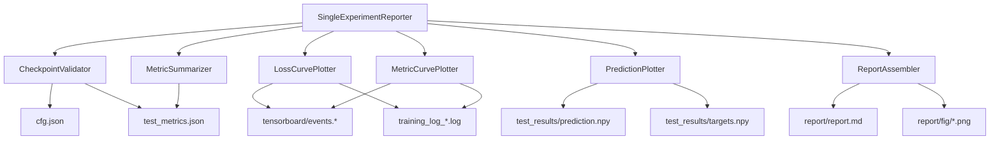

# Design Document: Single Experiment Report

## Overview

本设计为 BasicTS 框架新增一个 `SingleExperimentReporter` 模块，用于针对单次实验的完整训练过程生成结构化分析报告。该模块与现有的 `ExperimentAnalyzer`（多模型对比分析）互补，聚焦于单个实验检查点的深度分析。

核心能力包括：
- 从 TensorBoard 事件文件或训练日志中提取并绘制损失曲线和指标曲线
- 从 `test_metrics.json` 中汇总最终评估指标
- 从 `test_results/` 中加载预测结果并绘制预测对比图
- 将所有分析结果整合为一份 Markdown 报告

设计遵循现有 `basicts.analysis` 模块的架构风格，采用组合模式将各分析步骤封装为独立组件，通过统一的 Reporter 类协调调用。

## Architecture



**架构决策说明：**

1. **组合模式而非继承**：各分析组件（Plotter、Summarizer）作为独立类，由 `SingleExperimentReporter` 组合调用。这与现有 `ExperimentAnalyzer` 的设计风格一致，便于独立测试和复用。

2. **数据源优先级**：损失/指标曲线数据优先从 TensorBoard 事件文件提取（结构化、精确），回退到训练日志解析（文本解析、可能有精度损失）。

3. **优雅降级**：每个分析步骤独立执行，某步骤因数据缺失失败不影响其他步骤。报告中对缺失部分给出明确提示。

4. **CLI 子模块**：通过 `python -m basicts.analysis.single` 提供独立入口，不影响现有 `python -m basicts.analysis` 的多模型分析功能。

## Components and Interfaces

### 1. SingleExperimentReporter（主入口类）

```python
class SingleExperimentReporter:
    """单次实验报告生成器。"""

    def __init__(self, ckpt_dir: str, output_dir: Optional[str] = None, num_samples: int = 200):
        """
        Args:
            ckpt_dir: 实验检查点目录路径（哈希目录或模型目录）
            output_dir: 报告输出目录，默认为 {ckpt_dir}/report/
            num_samples: 预测曲线展示的时间步数量，默认 200
        """
        ...

    def generate_report(self) -> str:
        """生成完整报告，返回报告文件绝对路径。"""
        ...

    def plot_loss_curves(self) -> Optional[Figure]:
        """绘制损失曲线，返回 matplotlib Figure 对象。"""
        ...

    def plot_metric_curves(self) -> Optional[Figure]:
        """绘制指标曲线，返回 matplotlib Figure 对象。"""
        ...

    def plot_predictions(self) -> Optional[Figure]:
        """绘制预测对比图，返回 matplotlib Figure 对象。"""
        ...

    def summarize_metrics(self) -> dict:
        """返回测试集评估指标字典。"""
        ...
```

### 2. CheckpointValidator（检查点验证器）

```python
class CheckpointValidator:
    """验证检查点目录完整性并解析配置。"""

    def __init__(self, ckpt_dir: str):
        ...

    def validate(self) -> "ExperimentConfig":
        """验证目录并返回解析后的配置。失败时抛出异常。"""
        ...

    @staticmethod
    def resolve_checkpoint_dir(path: str) -> str:
        """
        解析检查点目录路径。
        如果 path 是哈希目录（含 cfg.json），直接返回。
        如果 path 是模型目录（含子目录），返回修改时间最晚的子目录。
        """
        ...
```

### 3. LossCurvePlotter（损失曲线绘制器）

```python
class LossCurvePlotter:
    """从 TensorBoard 事件或训练日志中提取并绘制损失曲线。"""

    def __init__(self, ckpt_dir: str, config: "ExperimentConfig"):
        ...

    def plot(self) -> Optional[Figure]:
        """绘制损失曲线图，返回 Figure 或 None（数据不可用时）。"""
        ...

    def extract_loss_data(self) -> Dict[str, List[float]]:
        """提取损失数据，键为 'train', 'val', 'test'，值为各 epoch 的 loss 列表。"""
        ...
```

### 4. MetricCurvePlotter（指标曲线绘制器）

```python
class MetricCurvePlotter:
    """绘制各评估指标随 epoch 变化的曲线。"""

    def __init__(self, ckpt_dir: str, config: "ExperimentConfig"):
        ...

    def plot(self) -> Optional[Figure]:
        """绘制指标曲线子图，返回 Figure 或 None。"""
        ...

    def extract_metric_data(self) -> Dict[str, Dict[str, List[float]]]:
        """提取指标数据。外层键为指标名，内层键为 'train'/'val'。"""
        ...
```

### 5. MetricSummarizer（指标汇总器）

```python
class MetricSummarizer:
    """读取 test_metrics.json 并生成结构化摘要。"""

    def __init__(self, ckpt_dir: str, config: "ExperimentConfig"):
        ...

    def summarize(self) -> dict:
        """返回指标字典，包含 'overall' 和各 'horizon_N' 键。"""
        ...

    def to_markdown_table(self) -> str:
        """生成 Markdown 格式的指标表格。"""
        ...

    def compute_zone_averages(self) -> Optional[Dict[str, float]]:
        """计算估计区间和预测区间的平均 R2（仅软测量任务）。"""
        ...
```

### 6. PredictionPlotter（预测曲线绘制器）

```python
class PredictionPlotter:
    """加载预测结果并绘制预测对比图。"""

    def __init__(self, ckpt_dir: str, config: "ExperimentConfig", num_samples: int = 200):
        ...

    def plot(self) -> Optional[Figure]:
        """绘制预测对比子图，返回 Figure 或 None。"""
        ...
```

### 7. ReportAssembler（报告组装器）

```python
class ReportAssembler:
    """将各分析结果组装为 Markdown 报告。"""

    def __init__(self, config: "ExperimentConfig", output_dir: str):
        ...

    def assemble(
        self,
        loss_fig_path: Optional[str],
        metric_fig_path: Optional[str],
        prediction_fig_path: Optional[str],
        metrics_table: str,
        skipped_sections: List[str],
    ) -> str:
        """组装报告并保存，返回报告文件绝对路径。"""
        ...
```

## Data Models

### ExperimentConfig（实验配置数据类）

```python
@dataclass
class ExperimentConfig:
    """从 cfg.json 解析的实验配置。"""

    model_name: str           # model.name
    dataset_name: str         # dataset_name
    input_len: int            # model_config.input_len
    output_len: int           # model_config.output_len
    measurement_lag: int      # measurement_lag（默认 0）
    metrics: List[str]        # metrics 列表（如 ["MAE", "MSE", "RMSE", "R2"]）
    eval_horizons: List[int]  # eval_horizons 列表（如 [1, 3, 6]）
    target_vars: List[int]    # target_vars 列表（如 [6]）
    is_soft_sensor: bool      # 是否为软测量任务
    ckpt_dir: str             # 检查点目录绝对路径
    raw_config: Dict[str, Any]  # 原始 cfg.json 内容
```

### TrainingCurveData（训练曲线数据）

```python
@dataclass
class TrainingCurveData:
    """训练过程中的曲线数据。"""

    epochs: List[int]                          # epoch 编号列表
    losses: Dict[str, List[float]]             # {'train': [...], 'val': [...], 'test': [...]}
    metrics: Dict[str, Dict[str, List[float]]] # {'MAE': {'train': [...], 'val': [...]}, ...}
    early_stop_epoch: Optional[int]            # Early stopping 触发的 epoch（None 表示未触发）
```

### 文件系统结构

```
{ckpt_dir}/
├── cfg.json                    # 实验配置（必需）
├── test_metrics.json           # 测试指标（必需）
├── tensorboard/                # TensorBoard 事件文件（可选）
│   └── events.out.tfevents.*
├── training_log_*.log          # 训练日志（可选，TensorBoard 不可用时的回退）
├── test_results/               # 预测结果（可选）
│   ├── prediction.npy
│   └── targets.npy
└── report/                     # 生成的报告输出目录
    ├── report.md
    └── fig/
        ├── loss_curves.png
        ├── metric_curves.png
        └── prediction_curves.png
```

## Correctness Properties

*A property is a characteristic or behavior that should hold true across all valid executions of a system — essentially, a formal statement about what the system should do. Properties serve as the bridge between human-readable specifications and machine-verifiable correctness guarantees.*

### Property 1: Required file validation

*For any* directory path, the checkpoint validator SHALL report exactly the set of missing required files (cfg.json, test_metrics.json) — if a file exists it is not reported as missing, and if it does not exist it is reported with its expected full path.

**Validates: Requirements 1.1, 1.2, 1.3**

### Property 2: Config extraction preserves source values

*For any* valid cfg.json content, the extracted `ExperimentConfig` fields (model_name, dataset_name, input_len, output_len, measurement_lag) SHALL exactly match the corresponding values in the source JSON structure.

**Validates: Requirements 1.4**

### Property 3: Latest directory selection

*For any* model directory containing one or more subdirectories with different modification times, `resolve_checkpoint_dir` SHALL return the subdirectory with the most recent modification time.

**Validates: Requirements 1.6**

### Property 4: Training log loss parsing round-trip

*For any* valid training log content containing epoch results in the BasicTS log format, the parsed loss values (train/loss, val/loss, test/loss) for each epoch SHALL numerically match the values written in the log lines.

**Validates: Requirements 2.2**

### Property 5: Partial loss curve handling

*For any* subset of available loss types (train, val, test), the loss curve plotter SHALL produce a figure containing exactly as many line objects as there are available loss types, and the legend SHALL contain only labels for the plotted curves.

**Validates: Requirements 2.7**

### Property 6: Metric subplot count matches configuration

*For any* list of configured metrics where data is available, the metric curve figure SHALL contain exactly as many subplots as there are metrics with available data.

**Validates: Requirements 3.1, 3.2**

### Property 7: Metrics table contains all values formatted correctly

*For any* valid test_metrics.json containing an "overall" section, the generated Markdown table SHALL contain each metric value formatted to exactly 4 decimal places, and for any set of "horizon_N" keys, the horizon table SHALL contain one row per horizon with the correct R2 value.

**Validates: Requirements 4.1, 4.2, 4.3**

### Property 8: Zone R2 calculation correctness

*For any* set of horizon R2 values and a measurement_lag ≥ 1, the estimation zone average R2 SHALL equal the arithmetic mean of R2 values for horizons ≤ measurement_lag, and the prediction zone average R2 SHALL equal the arithmetic mean of R2 values for horizons > measurement_lag.

**Validates: Requirements 4.4**

### Property 9: Target variable dimension extraction

*For any* prediction array with multiple feature dimensions and a target_vars configuration, the prediction plotter SHALL extract and plot only the dimensions specified in target_vars.

**Validates: Requirements 5.1**

### Property 10: Prediction subplot count matches eval_horizons

*For any* eval_horizons configuration list, the prediction figure SHALL contain exactly as many subplots as there are entries in eval_horizons.

**Validates: Requirements 5.2, 5.4**

### Property 11: Sample count limiting

*For any* num_samples parameter value and available data length, the number of displayed time steps SHALL equal min(num_samples, available_data_length).

**Validates: Requirements 5.6**

### Property 12: Report content completeness

*For any* experiment configuration, the generated report SHALL contain all specified header fields (generation time, model name, dataset name, input length, output length, measurement_lag), all image references SHALL use relative paths of the form `fig/<filename>.png`, and any skipped section SHALL contain a notice indicating data unavailability.

**Validates: Requirements 6.4, 6.5, 6.7**

### Property 13: num_samples range validation

*For any* integer value provided as num_samples, the CLI SHALL accept it if and only if it is in the range [1, 10000]; values outside this range SHALL cause a non-zero exit code.

**Validates: Requirements 7.3, 7.5**

### Property 14: summarize_metrics returns complete data

*For any* valid test_metrics.json, the `summarize_metrics()` method SHALL return a dictionary containing an "overall" key with all metric values matching the source file, and for each "horizon_N" key in the source, a corresponding entry in the returned dictionary with matching values.

**Validates: Requirements 8.6**

## Error Handling

| 场景 | 处理方式 | 用户可见行为 |
|------|----------|-------------|
| ckpt_dir 路径不存在 | 抛出 `FileNotFoundError` | CLI 输出错误信息并退出（exit code 1） |
| ckpt_dir 非目录 | 抛出 `NotADirectoryError` | CLI 输出错误信息并退出（exit code 1） |
| cfg.json 缺失 | 抛出 `FileNotFoundError`，消息含文件名和路径 | 实例化失败，明确指出缺失文件 |
| test_metrics.json 缺失 | 抛出 `FileNotFoundError`，消息含文件名和路径 | 实例化失败，明确指出缺失文件 |
| cfg.json 格式无效 | 抛出 `ValueError`，消息含文件路径 | 实例化失败，指出 JSON 解析错误 |
| 模型目录下无子目录 | 抛出 `FileNotFoundError` | 指出未找到实验检查点 |
| TensorBoard 事件文件不可读 | 回退到训练日志解析 | 透明回退，无用户感知 |
| TensorBoard 和日志均不存在 | 跳过损失/指标曲线 | 报告中注明"数据不可用" |
| test_results/ 不存在 | 跳过预测曲线 | 报告中注明需设置 save_results=True |
| prediction.npy 加载失败 | 跳过预测曲线 | 报告中注明数据加载失败 |
| num_samples 超出范围 | argparse 验证失败 | CLI 输出有效范围并退出（exit code 2） |
| matplotlib 未安装 | 跳过所有绘图 | 报告仅含文本部分，提示安装 matplotlib |

**错误传播策略：**
- 必需文件缺失（cfg.json、test_metrics.json）：立即失败，不生成报告
- 可选数据缺失（TensorBoard、日志、预测结果）：优雅降级，跳过对应分析步骤
- 绘图库缺失：降级为纯文本报告

## Testing Strategy

### 测试框架

- **单元测试**：pytest（项目已有 pytest 配置）
- **属性测试**：hypothesis（Python 生态标准 PBT 库）
- 每个属性测试配置最少 100 次迭代

### 属性测试（Property-Based Tests）

针对上述 14 个 Correctness Properties 编写属性测试：

- **Property 1-3**：测试 `CheckpointValidator` 的文件验证和目录解析逻辑
- **Property 4**：测试训练日志解析器的正确性（生成随机日志内容，验证解析结果）
- **Property 5-6**：测试绘图组件的子图/线条数量逻辑
- **Property 7-8**：测试 `MetricSummarizer` 的表格生成和区间计算
- **Property 9-11**：测试 `PredictionPlotter` 的数据提取和样本限制
- **Property 12**：测试 `ReportAssembler` 的内容完整性
- **Property 13**：测试 CLI 参数验证
- **Property 14**：测试 `summarize_metrics()` 的数据完整性

每个属性测试标注格式：
```python
# Feature: single-experiment-report, Property {N}: {property_text}
```

### 单元测试（Example-Based Tests）

- 使用真实检查点目录（`checkpoints/Debutanizer_benchmark/DLinear/...`）进行集成验证
- 测试 TensorBoard 事件文件读取（需要 tensorboard 库）
- 测试 Early Stopping 标注（垂直虚线）
- 测试 CLI `--help` 输出
- 测试 `SingleExperimentReporter` 的 API 方法返回类型

### 测试目录结构

```
tests/
└── analysis_test/
    ├── __init__.py
    ├── test_checkpoint_validator.py      # Property 1-3 + edge cases
    ├── test_log_parser.py                # Property 4
    ├── test_loss_curve_plotter.py        # Property 5
    ├── test_metric_curve_plotter.py      # Property 6
    ├── test_metric_summarizer.py         # Property 7, 8, 14
    ├── test_prediction_plotter.py        # Property 9, 10, 11
    ├── test_report_assembler.py          # Property 12
    ├── test_cli.py                       # Property 13 + smoke tests
    └── conftest.py                       # 共享 fixtures（临时目录、mock 数据）
```
