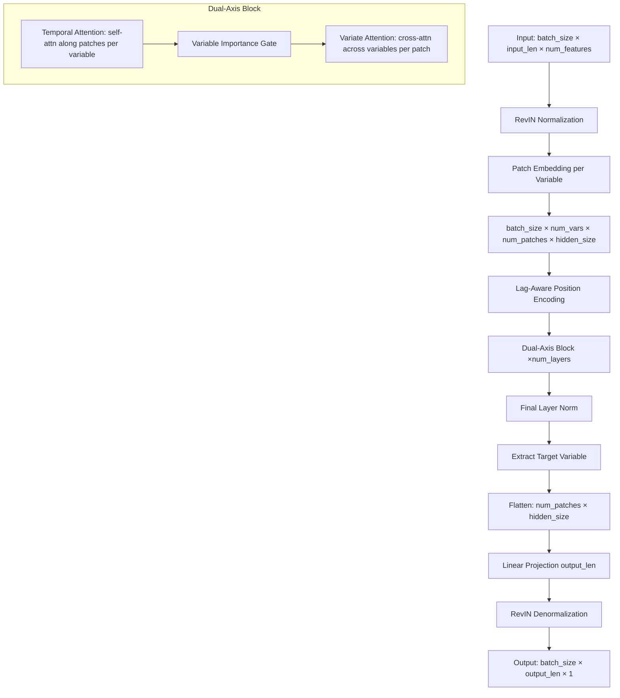

# Design Document: PatchXformer

## Overview

PatchXformer is a dual-axis attention Transformer designed specifically for soft sensing tasks. It combines PatchTST's temporal patch attention with iTransformer's variate attention, augmented with soft-sensor-specific mechanisms: variable importance gating, lag-aware positional encoding, and asymmetric cross-variate attention.

**Key Design Decisions:**

1. **All variables get patch embedding**   Unlike TimeXer which only patches the target variable, PatchXformer patches all variables uniformly, enabling richer temporal representations for every input signal.
2. **Variate attention at every patch position**   Instead of a single global token (TimeXer), cross-variable interaction happens at each patch position, providing fine-grained temporal resolution for inter-variable dependencies.
3. **Dual-axis blocks: Temporal   Variate**   Each block first captures temporal patterns within each variable, then captures cross-variable dependencies. Stacking `num_layers` blocks progressively refines both axes.
4. **Variable importance gate**   A learnable sigmoid gate before variate attention allows the model to suppress irrelevant process variables, critical for industrial soft sensors with many noisy inputs.
5. **Lag-aware positional encoding**   Adds a learnable embedding to patches overlapping the measurement lag boundary, helping the model distinguish estimation-zone from prediction-zone patches.
6. **Asymmetric attention**   When the target variable is present in input, process variables serve as K/V and target as Q, directing information flow from process to target. When `exclude_target_from_input=True`, standard self-attention is used.

**Relationship to Existing Models:**

| Aspect | PatchTST | iTransformer | TimeXer | PatchXformer |
|--------|----------|--------------|---------|-----------------|
| Patching | All vars | None | Target only | All vars |
| Temporal attn | Per-variable | None | Per-variable (target) | Per-variable |
| Variate attn | None | Full sequence | Global token cross-attn | Per-patch position |
| Soft sensor | No | No | Partial | Full (gate, lag, asymmetric) |

## Architecture



### Data Flow Detail

1. **Input**: `[B, L, N]` where B=batch, L=input_len, N=num_features
2. **RevIN**: Instance normalization per feature   `[B, L, N]`
3. **Patch Embedding**: Each variable independently patched   `[B, N, P, H]` where P=num_patches, H=hidden_size
4. **Lag Encoding**: Add lag embedding to patches overlapping lag boundary   `[B, N, P, H]`
5. **Dual-Axis Block** (repeated `num_layers` times):
   - Reshape to `[B*N, P, H]`   Temporal self-attention   reshape back to `[B, N, P, H]`
   - Variable importance gate: compute `[B, N, 1, 1]` weights, multiply
   - Reshape to `[B*P, N, H]`   Variate attention (asymmetric or self)   reshape back to `[B, N, P, H]`
6. **Final LayerNorm**: Applied to `[B, N, P, H]`
7. **Head**: Extract target var `[B, 1, P, H]`   flatten to `[B, P*H]`   linear   `[B, output_len]`   reshape to `[B, output_len, 1]`
8. **RevIN denorm**: Restore original scale

## Components and Interfaces

### PatchXformerConfig (dataclass)

```python
@dataclass
class PatchXformerConfig(BasicTSModelConfig):
    # Standard fields (matching PatchTST/iTransformer conventions)
    input_len: int
    output_len: int
    num_features: int
    patch_len: int = 16
    patch_stride: int = 8
    padding: bool = True
    hidden_size: int = 256
    n_heads: int = 4
    intermediate_size: int = 512
    hidden_act: str = "gelu"
    num_layers: int = 2
    dropout: float = 0.1
    use_revin: bool = True
    output_attentions: bool = False
    
    # Soft-sensor-specific fields
    measurement_lag: int = 0
    use_variable_gate: bool = True
    use_asymmetric_attn: bool = True
    target_var_index: int = -1  # -1 means last variable
```

### PatchXformerBackbone

**Responsibility**: Feature extraction via dual-axis attention blocks.

**Interface**:
```python
class PatchXformerBackbone(nn.Module):
    def __init__(self, config: PatchXformerConfig): ...
    def forward(self, inputs: torch.Tensor) -> Tuple[torch.Tensor, Optional[List[torch.Tensor]]]:
        """
        Args:
            inputs: [batch_size, input_len, num_features]
        Returns:
            hidden_states: [batch_size, num_features, num_patches, hidden_size]
            attn_weights: Optional list of attention weight tensors
        """
```

**Internal Components**:
- `self.patch_embedding`: `PatchEmbedding` from `basicts.modules.embed`
- `self.lag_embedding`: `nn.Parameter` of shape `[1, 1, 1, hidden_size]` (when measurement_lag > 0)
- `self.dual_axis_blocks`: `nn.ModuleList` of `DualAxisBlock`
- `self.final_norm`: `nn.LayerNorm(hidden_size)`

### DualAxisBlock

**Responsibility**: One layer of temporal attention followed by variate attention.

**Interface**:
```python
class DualAxisBlock(nn.Module):
    def __init__(self, config: PatchXformerConfig): ...
    def forward(
        self,
        hidden_states: torch.Tensor,  # [B, N, P, H]
        target_var_index: int = -1,
        use_asymmetric: bool = True,
        output_attentions: bool = False
    ) -> Tuple[torch.Tensor, Optional[Tuple[torch.Tensor, torch.Tensor]]]:
        """
        Returns:
            hidden_states: [B, N, P, H]
            attn_weights: Optional tuple of (temporal_attn, variate_attn)
        """
```

**Internal Components**:
- `self.temporal_attn`: `MultiHeadAttention`
- `self.temporal_ffn`: `MLPLayer`
- `self.temporal_norm1`: `nn.LayerNorm`
- `self.temporal_norm2`: `nn.LayerNorm`
- `self.variate_attn`: `MultiHeadAttention`
- `self.variate_ffn`: `MLPLayer`
- `self.variate_norm1`: `nn.LayerNorm`
- `self.variate_norm2`: `nn.LayerNorm`
- `self.variable_gate`: `VariableImportanceGate` (optional)

### VariableImportanceGate

**Responsibility**: Compute per-variable importance weights.

**Interface**:
```python
class VariableImportanceGate(nn.Module):
    def __init__(self, hidden_size: int, num_patches: int): ...
    def forward(self, hidden_states: torch.Tensor) -> torch.Tensor:
        """
        Args:
            hidden_states: [B, N, P, H]
        Returns:
            gated_states: [B, N, P, H] (element-wise multiplied by importance weights)
        """
```

**Implementation**:
- Pool across patches: `[B, N, P, H]`   mean over P   `[B, N, H]`
- Linear projection: `[B, N, H]`   `[B, N, 1]`
- Sigmoid activation   `[B, N, 1, 1]` (broadcast-ready)
- Element-wise multiply with input

### PatchXformerForForecasting

**Responsibility**: Task-specific wrapper with RevIN and forecasting head.

**Interface**:
```python
class PatchXformerForForecasting(nn.Module):
    def __init__(self, config: PatchXformerConfig): ...
    def forward(
        self,
        inputs: torch.Tensor,  # [B, L, N]
        inputs_timestamps: Optional[torch.Tensor] = None  # [B, L, T]
    ) -> Union[torch.Tensor, Dict[str, Any]]:
        """
        Returns:
            prediction: [B, output_len, 1] or dict with "prediction" and "attn_weights"
        """
```

**Internal Components**:
- `self.backbone`: `PatchXformerBackbone`
- `self.revin`: `RevIN` (optional)
- `self.head_dropout`: `nn.Dropout`
- `self.flatten`: `nn.Flatten(start_dim=-2)`
- `self.forecasting_head`: `nn.Linear(num_patches * hidden_size, output_len)`

## Data Models

### Tensor Shapes Through the Pipeline

| Stage | Shape | Description |
|-------|-------|-------------|
| Input | `[B, L, N]` | Raw multivariate time series |
| After RevIN | `[B, L, N]` | Normalized input |
| After Patch Embed | `[B, N, P, H]` | Patched and embedded per variable |
| After Lag Encoding | `[B, N, P, H]` | With lag positional info |
| Temporal Attn (internal) | `[B*N, P, H]` | Reshaped for per-variable attention |
| After Temporal Attn | `[B, N, P, H]` | Reshaped back |
| Gate weights | `[B, N, 1, 1]` | Per-variable importance |
| Variate Attn (internal) | `[B*P, N, H]` | Reshaped for per-patch cross-var attn |
| After Variate Attn | `[B, N, P, H]` | Reshaped back |
| Target extraction | `[B, 1, P, H]` | Target variable only |
| Flatten | `[B, P*H]` | Flattened for linear head |
| Output | `[B, output_len, 1]` | Final prediction |

### Configuration Parameters

| Parameter | Type | Default | Description |
|-----------|------|---------|-------------|
| `input_len` | int | required | Input sequence length |
| `output_len` | int | required | Prediction horizon |
| `num_features` | int | required | Number of input variables |
| `patch_len` | int | 16 | Length of each patch |
| `patch_stride` | int | 8 | Stride between patches |
| `padding` | bool | True | Pad input before patching |
| `hidden_size` | int | 256 | Hidden dimension |
| `n_heads` | int | 4 | Number of attention heads |
| `intermediate_size` | int | 512 | FFN intermediate dimension |
| `hidden_act` | str | "gelu" | Activation function |
| `num_layers` | int | 2 | Number of dual-axis blocks |
| `dropout` | float | 0.1 | Dropout rate |
| `use_revin` | bool | True | Use RevIN normalization |
| `output_attentions` | bool | False | Return attention weights |
| `measurement_lag` | int | 0 | Measurement delay in time steps |
| `use_variable_gate` | bool | True | Enable variable importance gating |
| `use_asymmetric_attn` | bool | True | Enable asymmetric cross-variate attention |
| `target_var_index` | int | -1 | Target variable position (-1 = last) |

### num_patches Calculation

```python
num_patches = (input_len - patch_len) // patch_stride + 1
if padding:
    num_patches += 1
```

With defaults (input_len=96, patch_len=16, patch_stride=8, padding=True):
- `num_patches = (96 - 16) // 8 + 1 + 1 = 11 + 1 = 12`

### Lag Boundary Calculation

The lag boundary determines which patches receive the lag embedding:
```python
# Patches whose temporal coverage overlaps with the lag boundary
lag_boundary_time = input_len - measurement_lag
for patch_idx in range(num_patches):
    patch_start = patch_idx * patch_stride
    patch_end = patch_start + patch_len
    if patch_start < lag_boundary_time <= patch_end:
        # This patch overlaps the lag boundary
        add_lag_embedding(patch_idx)
```

## Correctness Properties

*A property is a characteristic or behavior that should hold true across all valid executions of a system   essentially, a formal statement about what the system should do. Properties serve as the bridge between human-readable specifications and machine-verifiable correctness guarantees.*

### Property 1: Output Shape Invariant

*For any* valid input tensor of shape `[B, L, N]` where B > 0, L = input_len, and N = num_features, the model forward pass SHALL produce output of shape `[B, output_len, 1]`, regardless of batch size, number of features, or whether timestamps are provided.

**Validates: Requirements 8.3, 9.2**

### Property 2: Patch Embedding Shape

*For any* valid input tensor of shape `[B, L, N]`, the backbone's patch embedding stage SHALL produce a tensor of shape `[B, N, num_patches, hidden_size]` where num_patches follows the formula `(input_len - patch_len) // patch_stride + 1 + (1 if padding else 0)`.

**Validates: Requirements 2.1, 2.4**

### Property 3: Temporal Attention Variable Independence

*For any* input tensor, modifying the values of variable `i` SHALL NOT change the temporal attention output for any other variable `j   i`. That is, temporal attention operates independently per variable.

**Validates: Requirements 3.1**

### Property 4: Variate Self-Attention Equivariance

*For any* input tensor and any permutation of variables, when `use_asymmetric_attn=False`, applying the permutation to the input and then running variate attention SHALL produce the same result as running variate attention first and then applying the permutation to the output.

**Validates: Requirements 4.3, 10.2**

### Property 5: Variable Importance Gate Bounds

*For any* input tensor of shape `[B, N, P, H]`, the variable importance gate SHALL produce weights in the range [0, 1] with shape `[B, N, 1, 1]`, and the gated output SHALL equal the element-wise product of input and broadcast weights.

**Validates: Requirements 6.1, 6.2, 6.3**

### Property 6: Gate Bypass When Disabled

*For any* input tensor, when `use_variable_gate=False`, the output of the temporal attention sublayer SHALL pass unchanged (identity) to the variate attention sublayer within each dual-axis block.

**Validates: Requirements 6.4**

### Property 7: Lag Encoding Activation

*For any* valid configuration with `measurement_lag > 0`, the lag embedding SHALL be added only to patches whose temporal coverage overlaps the lag boundary. When `measurement_lag = 0`, no lag embedding SHALL be applied and the output SHALL be identical to standard positional encoding.

**Validates: Requirements 1.4, 7.1, 7.3**

### Property 8: RevIN Round-Trip

*For any* input tensor, applying RevIN normalization followed by RevIN denormalization (with no transformation in between) SHALL produce a tensor approximately equal to the original input (within floating-point tolerance).

**Validates: Requirements 8.4**

### Property 9: Exclude-Target Mode Correctness

*For any* valid input containing only process variables (no target), when the model is configured with `use_asymmetric_attn=True`, the variate attention SHALL fall back to standard self-attention and the model SHALL produce valid output of shape `[B, output_len, 1]`.

**Validates: Requirements 10.1, 10.2**

### Property 10: Asymmetric Attention Directionality

*For any* input containing both process and target variables with `use_asymmetric_attn=True`, the target variable's representation after variate attention SHALL depend on process variable values (cross-attention: target as Q, process as K/V), while process variable representations SHALL remain unchanged by the variate attention sublayer.

**Validates: Requirements 4.2, 10.3**

## Error Handling

| Scenario | Handling |
|----------|----------|
| `num_features < 2` with `use_asymmetric_attn=True` | Raise `ValueError`: asymmetric attention requires at least 2 variables (1 process + 1 target) |
| `patch_len > input_len` | Raise `ValueError`: patch_len must be   input_len |
| `patch_stride > patch_len` | Allow (non-overlapping patches) but log warning |
| `measurement_lag >= input_len` | Raise `ValueError`: measurement_lag must be < input_len |
| `target_var_index` out of bounds | Raise `IndexError` with descriptive message |
| `hidden_size % n_heads != 0` | Raise `ValueError`: hidden_size must be divisible by n_heads |
| `inputs.shape[1] != input_len` | Raise `ValueError` with expected vs actual length |
| NaN in input | RevIN handles gracefully (instance norm); if all-NaN variable, gate will learn to suppress it |

## Testing Strategy

### Property-Based Tests (PBT)

**Library**: `hypothesis` with `torch` strategy extensions

**Configuration**: Minimum 100 iterations per property test.

Each property from the Correctness Properties section will be implemented as a single property-based test:

1. **Output shape invariant**   Generate random (B, L, N) inputs with varying dimensions, verify output shape.
2. **Patch embedding shape**   Generate random configs (input_len, patch_len, patch_stride, padding), verify intermediate shape.
3. **Temporal attention independence**   Generate random inputs, perturb one variable, verify others unchanged.
4. **Variate equivariance**   Generate random inputs and permutations, verify equivariance.
5. **Gate bounds**   Generate random inputs, verify gate output range and shape.
6. **Gate bypass**   Compare outputs with gate enabled vs disabled.
7. **Lag encoding activation**   Generate configs with various lag values, verify correct patches receive embedding.
8. **RevIN round-trip**   Generate random inputs, verify norm→denorm   identity.
9. **Exclude-target mode**   Generate inputs without target, verify valid output.
10. **Asymmetric directionality**   Verify target depends on process vars, process vars unchanged.

**Tag format**: `Feature: soft-sensing-transformer, Property {N}: {title}`

### Unit Tests (Example-Based)

- Config dataclass field existence and defaults
- Module structure verification (correct submodules instantiated)
- Forward pass with concrete inputs (e.g., EthyDistillation-like: 37 features, input_len=96, output_len=12)
- `output_attentions=True` returns dict with correct keys
- `output_attentions=False` returns tensor
- Error cases (invalid configs raise appropriate exceptions)

### Integration Tests

- End-to-end training loop with `BasicTSSoftSensorConfig`
- Compatibility with `BasicTSLauncher.launch_training`
- Checkpoint save/load
- Evaluation with `eval_horizons=[1, 6, 12]`

### Smoke Tests

- Module imports correctly from `basicts.models.PatchXformer`
- Directory structure matches requirement 9.1
