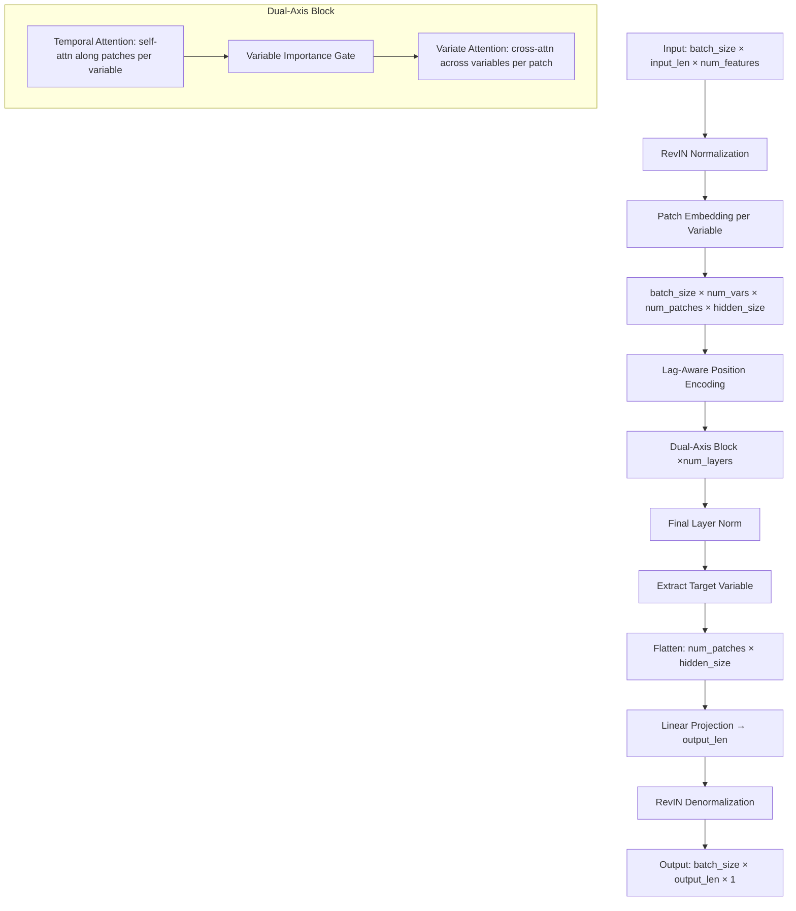

# 设计文档：PatchXformer

## 概述

PatchXformer 是一种专为软测量任务设计的双轴注意力 Transformer。它结合了 PatchTST 的时间 patch 注意力与 iTransformer 的变量注意力，并增加了软测量特有的机制：变量重要性门控、滞后感知位置编码和非对称跨变量注意力。

**关键设计决策：**

1. **所有变量均进行 patch 嵌入**——与 TimeXer 仅对目标变量进行 patch 不同，PatchXformer 对所有变量统一进行 patch 处理，为每个输入信号提供更丰富的时间表示。
2. **在每个 patch 位置进行变量注意力**——不同于 TimeXer 使用单一全局 token，跨变量交互在每个 patch 位置发生，为变量间依赖关系提供细粒度的时间分辨率。
3. **双轴块：时间→变量**——每个块先捕获每个变量内的时间模式，再捕获跨变量依赖关系。堆叠 `num_layers` 个块逐步细化两个轴。
4. **变量重要性门控**——在变量注意力之前的可学习 sigmoid 门控允许模型抑制无关的过程变量，这对于含有大量噪声输入的工业软测量至关重要。
5. **滞后感知位置编码**——为覆盖测量滞后边界的 patch 添加可学习嵌入，帮助模型区分估计区域和预测区域的 patch。
6. **非对称注意力**——当目标变量存在于输入中时，过程变量作为 K/V，目标变量作为 Q，引导信息从过程变量流向目标变量。当 `exclude_target_from_input=True` 时，使用标准自注意力。

**与现有模型的关系：**

| 方面 | PatchTST | iTransformer | TimeXer | PatchXformer |
|--------|----------|--------------|---------|-----------------|
| Patch 处理 | 所有变量 | 无 | 仅目标变量 | 所有变量 |
| 时间注意力 | 逐变量 | 无 | 逐变量（目标） | 逐变量 |
| 变量注意力 | 无 | 全序列 | 全局 token 交叉注意力 | 逐 patch 位置 |
| 软测量 | 否 | 否 | 部分 | 完整（门控、滞后、非对称） |

## 架构



### 数据流详情

1. **输入**：`[B, L, N]`，其中 B=批大小，L=input_len，N=num_features
2. **RevIN**：逐特征实例归一化→`[B, L, N]`
3. **Patch 嵌入**：每个变量独立进行 patch 处理→`[B, N, P, H]`，其中 P=num_patches，H=hidden_size
4. **滞后编码**：为覆盖滞后边界的 patch 添加滞后嵌入→`[B, N, P, H]`
5. **双轴块**（重复 `num_layers` 次）：
   - 重塑为 `[B*N, P, H]`→时间自注意力→重塑回 `[B, N, P, H]`
   - 变量重要性门控：计算 `[B, N, 1, 1]` 权重，逐元素相乘
   - 重塑为 `[B*P, N, H]`→变量注意力（非对称或自注意力）→重塑回 `[B, N, P, H]`
6. **最终 LayerNorm**：应用于 `[B, N, P, H]`
7. **预测头**：提取目标变量 `[B, 1, P, H]`→展平为 `[B, P*H]`→线性层→`[B, output_len]`→重塑为 `[B, output_len, 1]`
8. **RevIN 反归一化**：恢复原始尺度

## 组件与接口

### PatchXformerConfig（数据类）

```python
@dataclass
class PatchXformerConfig(BasicTSModelConfig):
    # 标准字段（遵循 PatchTST/iTransformer 约定）
    input_len: int
    output_len: int
    num_features: int
    patch_len: int = 16
    patch_stride: int = 8
    padding: bool = True
    hidden_size: int = 256
    n_heads: int = 4
    intermediate_size: int = 512
    hidden_act: str = "gelu"
    num_layers: int = 2
    dropout: float = 0.1
    use_revin: bool = True
    output_attentions: bool = False
    
    # 软测量特有字段
    measurement_lag: int = 0
    use_variable_gate: bool = True
    use_asymmetric_attn: bool = True
    target_var_index: int = -1  # -1 表示最后一个变量
```

### PatchXformerBackbone

**职责**：通过双轴注意力块进行特征提取。

**接口**：
```python
class PatchXformerBackbone(nn.Module):
    def __init__(self, config: PatchXformerConfig): ...
    def forward(self, inputs: torch.Tensor) -> Tuple[torch.Tensor, Optional[List[torch.Tensor]]]:
        """
        Args:
            inputs: [batch_size, input_len, num_features]
        Returns:
            hidden_states: [batch_size, num_features, num_patches, hidden_size]
            attn_weights: 可选的注意力权重张量列表
        """
```

**内部组件**：
- `self.patch_embedding`：来自 `basicts.modules.embed` 的 `PatchEmbedding`
- `self.lag_embedding`：形状为 `[1, 1, 1, hidden_size]` 的 `nn.Parameter`（当 measurement_lag > 0 时）
- `self.dual_axis_blocks`：`DualAxisBlock` 的 `nn.ModuleList`
- `self.final_norm`：`nn.LayerNorm(hidden_size)`

### DualAxisBlock

**职责**：一层时间注意力后接变量注意力。

**接口**：
```python
class DualAxisBlock(nn.Module):
    def __init__(self, config: PatchXformerConfig): ...
    def forward(
        self,
        hidden_states: torch.Tensor,  # [B, N, P, H]
        target_var_index: int = -1,
        use_asymmetric: bool = True,
        output_attentions: bool = False
    ) -> Tuple[torch.Tensor, Optional[Tuple[torch.Tensor, torch.Tensor]]]:
        """
        Returns:
            hidden_states: [B, N, P, H]
            attn_weights: 可选的 (temporal_attn, variate_attn) 元组
        """
```

**内部组件**：
- `self.temporal_attn`：`MultiHeadAttention`
- `self.temporal_ffn`：`MLPLayer`
- `self.temporal_norm1`：`nn.LayerNorm`
- `self.temporal_norm2`：`nn.LayerNorm`
- `self.variate_attn`：`MultiHeadAttention`
- `self.variate_ffn`：`MLPLayer`
- `self.variate_norm1`：`nn.LayerNorm`
- `self.variate_norm2`：`nn.LayerNorm`
- `self.variable_gate`：`VariableImportanceGate`（可选）

### VariableImportanceGate

**职责**：计算逐变量的重要性权重。

**接口**：
```python
class VariableImportanceGate(nn.Module):
    def __init__(self, hidden_size: int, num_patches: int): ...
    def forward(self, hidden_states: torch.Tensor) -> torch.Tensor:
        """
        Args:
            hidden_states: [B, N, P, H]
        Returns:
            gated_states: [B, N, P, H]（与重要性权重逐元素相乘后的结果）
        """
```

**实现**：
- 跨 patch 池化：`[B, N, P, H]`→对 P 维取均值→`[B, N, H]`
- 线性投影：`[B, N, H]`→`[B, N, 1]`
- Sigmoid 激活→`[B, N, 1, 1]`（可广播）
- 与输入逐元素相乘

### PatchXformerForForecasting

**职责**：带有 RevIN 和预测头的任务特定包装器。

**接口**：
```python
class PatchXformerForForecasting(nn.Module):
    def __init__(self, config: PatchXformerConfig): ...
    def forward(
        self,
        inputs: torch.Tensor,  # [B, L, N]
        inputs_timestamps: Optional[torch.Tensor] = None  # [B, L, T]
    ) -> Union[torch.Tensor, Dict[str, Any]]:
        """
        Returns:
            prediction: [B, output_len, 1] 或包含 "prediction" 和 "attn_weights" 的字典
        """
```

**内部组件**：
- `self.backbone`：`PatchXformerBackbone`
- `self.revin`：`RevIN`（可选）
- `self.head_dropout`：`nn.Dropout`
- `self.flatten`：`nn.Flatten(start_dim=-2)`
- `self.forecasting_head`：`nn.Linear(num_patches * hidden_size, output_len)`

## 数据模型

### 管道中的张量形状

| 阶段 | 形状 | 描述 |
|-------|-------|-------------|
| 输入 | `[B, L, N]` | 原始多变量时间序列 |
| RevIN 后 | `[B, L, N]` | 归一化后的输入 |
| Patch 嵌入后 | `[B, N, P, H]` | 逐变量 patch 化并嵌入 |
| 滞后编码后 | `[B, N, P, H]` | 带有滞后位置信息 |
| 时间注意力（内部） | `[B*N, P, H]` | 重塑用于逐变量注意力 |
| 时间注意力后 | `[B, N, P, H]` | 重塑回原形状 |
| 门控权重 | `[B, N, 1, 1]` | 逐变量重要性 |
| 变量注意力（内部） | `[B*P, N, H]` | 重塑用于逐 patch 跨变量注意力 |
| 变量注意力后 | `[B, N, P, H]` | 重塑回原形状 |
| 目标提取 | `[B, 1, P, H]` | 仅目标变量 |
| 展平 | `[B, P*H]` | 展平用于线性头 |
| 输出 | `[B, output_len, 1]` | 最终预测 |

### 配置参数

| 参数 | 类型 | 默认值 | 描述 |
|-----------|------|---------|-------------|
| `input_len` | int | 必填 | 输入序列长度 |
| `output_len` | int | 必填 | 预测时域 |
| `num_features` | int | 必填 | 输入变量数量 |
| `patch_len` | int | 16 | 每个 patch 的长度 |
| `patch_stride` | int | 8 | patch 之间的步长 |
| `padding` | bool | True | patch 前是否填充输入 |
| `hidden_size` | int | 256 | 隐藏维度 |
| `n_heads` | int | 4 | 注意力头数 |
| `intermediate_size` | int | 512 | FFN 中间维度 |
| `hidden_act` | str | "gelu" | 激活函数 |
| `num_layers` | int | 2 | 双轴块数量 |
| `dropout` | float | 0.1 | Dropout 率 |
| `use_revin` | bool | True | 是否使用 RevIN 归一化 |
| `output_attentions` | bool | False | 是否返回注意力权重 |
| `measurement_lag` | int | 0 | 测量延迟（时间步数） |
| `use_variable_gate` | bool | True | 是否启用变量重要性门控 |
| `use_asymmetric_attn` | bool | True | 是否启用非对称跨变量注意力 |
| `target_var_index` | int | -1 | 目标变量位置（-1 = 最后一个） |

### num_patches 计算

```python
num_patches = (input_len - patch_len) // patch_stride + 1
if padding:
    num_patches += 1
```

使用默认值（input_len=96, patch_len=16, patch_stride=8, padding=True）：
- `num_patches = (96 - 16) // 8 + 1 + 1 = 11 + 1 = 12`

### 滞后边界计算

滞后边界决定哪些 patch 接收滞后嵌入：
```python
# 时间覆盖范围与滞后边界重叠的 patch
lag_boundary_time = input_len - measurement_lag
for patch_idx in range(num_patches):
    patch_start = patch_idx * patch_stride
    patch_end = patch_start + patch_len
    if patch_start < lag_boundary_time <= patch_end:
        # 此 patch 与滞后边界重叠
        add_lag_embedding(patch_idx)
```

## 正确性属性

*属性是在系统所有有效执行中应保持为真的特征或行为——本质上是关于系统应做什么的形式化陈述。属性充当人类可读规范与机器可验证正确性保证之间的桥梁。*

### 属性 1：输出形状不变性

*对于任何*形状为 `[B, L, N]` 的有效输入张量（其中 B > 0，L = input_len，N = num_features），模型前向传播**应当**产生形状为 `[B, output_len, 1]` 的输出，无论批大小、特征数量或是否提供时间戳。

**验证：需求 8.3, 9.2**

### 属性 2：Patch 嵌入形状

*对于任何*形状为 `[B, L, N]` 的有效输入张量，骨干网络的 patch 嵌入阶段**应当**产生形状为 `[B, N, num_patches, hidden_size]` 的张量，其中 num_patches 遵循公式 `(input_len - patch_len) // patch_stride + 1 + (1 if padding else 0)`。

**验证：需求 2.1, 2.4**

### 属性 3：时间注意力变量独立性

*对于任何*输入张量，修改变量 `i` 的值**不应当**改变任何其他变量 `j≠i` 的时间注意力输出。即时间注意力逐变量独立运行。

**验证：需求 3.1**

### 属性 4：变量自注意力等变性

*对于任何*输入张量和任何变量排列，当 `use_asymmetric_attn=False` 时，先对输入应用排列再运行变量注意力**应当**产生与先运行变量注意力再对输出应用排列相同的结果。

**验证：需求 4.3, 10.2**

### 属性 5：变量重要性门控边界

*对于任何*形状为 `[B, N, P, H]` 的输入张量，变量重要性门控**应当**产生范围在 [0, 1] 内、形状为 `[B, N, 1, 1]` 的权重，且门控输出**应当**等于输入与广播权重的逐元素乘积。

**验证：需求 6.1, 6.2, 6.3**

### 属性 6：门控禁用时的旁路

*对于任何*输入张量，当 `use_variable_gate=False` 时，时间注意力子层的输出**应当**不变地（恒等）传递到每个双轴块内的变量注意力子层。

**验证：需求 6.4**

### 属性 7：滞后编码激活

*对于任何*`measurement_lag > 0` 的有效配置，滞后嵌入**应当**仅添加到时间覆盖范围与滞后边界重叠的 patch。当 `measurement_lag = 0` 时，不应用滞后嵌入，输出**应当**与标准位置编码相同。

**验证：需求 1.4, 7.1, 7.3**

### 属性 8：RevIN 往返

*对于任何*输入张量，先应用 RevIN 归一化再应用 RevIN 反归一化（中间无变换）**应当**产生与原始输入近似相等的张量（在浮点容差范围内）。

**验证：需求 8.4**

### 属性 9：排除目标模式正确性

*对于任何*仅包含过程变量（无目标变量）的有效输入，当模型配置为 `use_asymmetric_attn=True` 时，变量注意力**应当**回退到标准自注意力，且模型**应当**产生形状为 `[B, output_len, 1]` 的有效输出。

**验证：需求 10.1, 10.2**

### 属性 10：非对称注意力方向性

*对于任何*同时包含过程变量和目标变量且 `use_asymmetric_attn=True` 的输入，目标变量在变量注意力后的表示**应当**依赖于过程变量的值（交叉注意力：目标作为 Q，过程变量作为 K/V），而过程变量的表示**不应当**被变量注意力子层改变。

**验证：需求 4.2, 10.3**

## 错误处理

| 场景 | 处理方式 |
|----------|----------|
| `num_features < 2` 且 `use_asymmetric_attn=True` | 抛出 `ValueError`：非对称注意力需要至少 2 个变量（1 个过程变量 + 1 个目标变量） |
| `patch_len > input_len` | 抛出 `ValueError`：patch_len 必须 ≤ input_len |
| `patch_stride > patch_len` | 允许（非重叠 patch）但记录警告 |
| `measurement_lag >= input_len` | 抛出 `ValueError`：measurement_lag 必须 < input_len |
| `target_var_index` 越界 | 抛出 `IndexError` 并附带描述性消息 |
| `hidden_size % n_heads != 0` | 抛出 `ValueError`：hidden_size 必须能被 n_heads 整除 |
| `inputs.shape[1] != input_len` | 抛出 `ValueError` 并附带期望值与实际值 |
| 输入中含 NaN | RevIN 可优雅处理（实例归一化）；若某变量全为 NaN，门控将学会抑制它 |

## 测试策略

### 基于属性的测试（PBT）

**库**：`hypothesis` 配合 `torch` 策略扩展

**配置**：每个属性测试最少 100 次迭代。

正确性属性部分的每个属性将实现为一个基于属性的测试：

1. **输出形状不变性**——生成不同维度的随机 (B, L, N) 输入，验证输出形状。
2. **Patch 嵌入形状**——生成随机配置（input_len, patch_len, patch_stride, padding），验证中间形状。
3. **时间注意力独立性**——生成随机输入，扰动一个变量，验证其他变量不变。
4. **变量等变性**——生成随机输入和排列，验证等变性。
5. **门控边界**——生成随机输入，验证门控输出范围和形状。
6. **门控旁路**——比较门控启用与禁用时的输出。
7. **滞后编码激活**——生成不同滞后值的配置，验证正确的 patch 接收嵌入。
8. **RevIN 往返**——生成随机输入，验证归一化→反归一化≈恒等。
9. **排除目标模式**——生成不含目标的输入，验证有效输出。
10. **非对称方向性**——验证目标依赖于过程变量，过程变量不变。

**标签格式**：`Feature: soft-sensing-transformer, Property {N}: {title}`

### 单元测试（基于示例）

- Config 数据类字段存在性和默认值
- 模块结构验证（正确的子模块已实例化）
- 使用具体输入的前向传播（例如类似 EthyDistillation 的：37 个特征，input_len=96，output_len=12）
- `output_attentions=True` 返回包含正确键的字典
- `output_attentions=False` 返回张量
- 错误情况（无效配置抛出适当异常）

### 集成测试

- 使用 `BasicTSSoftSensorConfig` 的端到端训练循环
- 与 `BasicTSLauncher.launch_training` 的兼容性
- 检查点保存/加载
- 使用 `eval_horizons=[1, 6, 12]` 进行评估

### 冒烟测试

- 模块可从 `basicts.models.PatchXformer` 正确导入
- 目录结构符合需求 9.1
